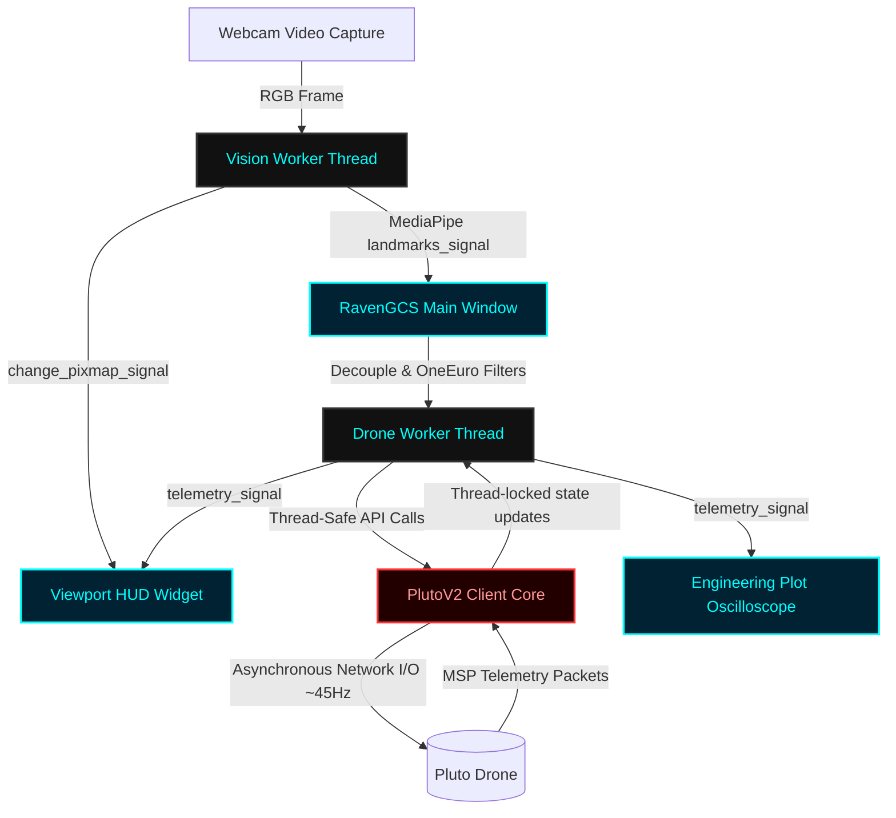

# 🛸 PlutoV2 & Raven GCS: Next-Gen Gestural Flight Control System

Welcome to the **PlutoV2 and Raven Ground Control Station (GCS)** codebase. This directory contains a robust, highly responsive, and thread-safe control system for the Pluto drone, featuring real-time camera-based hand gesture controls, military-grade HUD overlays, and high-frequency telemetry tracking.

---

## 📌 Codebase Architecture Overview

The system is split into two primary layers to isolate low-level network communications from the user interface rendering:

1. **Low-Level Interface (`PlutoV2`)**: An asynchronous python interface executing over a dedicated background network I/O loop (`_io_loop`) at ~45Hz. It manages TCP socket buffering, robustly parses the MultiWii Serial Protocol (MSP) packets, verifies checksums, and hosts a thread-locked shadow state.
2. **Raven Ground Control Station (`gcs/`)**: A PyQt6 graphical dashboard orchestrating concurrent worker threads for visual gesture tracking (`VisionWorker`) and drone interactions (`DroneWorker`), smooth signal filtration, and rich HUD dashboards.



---

## 📂 File-by-File Technical Directory

```
new/
├── docs/                      # Architectural specifications and comparisons
│   ├── LIB_COMPARISON.md      # PlutoV2 vs legacy plutocontrol comparison
│   └── PLUTOV2_DOCS.md        # Technical API spec for PlutoV2 library
├── gcs/                       # PyQt6 Ground Control Station application
│   ├── assets/                # Camera icons and landmarker task binaries
│   ├── utils/                 # Numerical filters, constants, and gesture structures
│   │   ├── __init__.py        
│   │   ├── constants.py       # Speed scales, deadzones, and system parameters
│   │   ├── filters.py         # OneEuro and LowPass signal smoothing filters
│   │   └── gestures.py        # HandChassis gesture translation engines
│   ├── widgets/               # Paint-canvas modules and sensor plots
│   │   ├── controls.py        # Connect deck, arming keys, and manual joggers
│   │   ├── engineering.py     # 8-CH servo meters and high-frequency IMU scopes
│   │   └── viewport.py        # Live video canvas overlayed with HUD instruments
│   ├── workers/               # Multithreading concurrency drivers
│   │   ├── drone_worker.py    # Background telemetry checker & action router
│   │   └── vision_worker.py   # OpenCV reader & MediaPipe landmarker thread
│   └── main_gcs.py            # Main PyQt6 entrypoint, router, and key binder
├── tests/                     # Validation scripts
├── gesture_controller.py      # Standalone two-handed console flying script
├── hand_landmarker.task       # MediaPipe Hand Landmarking configuration binary
├── plutov2.py                 # Core MultiWii Serial Protocol library
└── requirements.txt           # Virtual environment package requirements
```

---

## 🛠️ Deep Dive: How Each Component Works

### 1. The Communications Engine (`plutov2.py`)
This is the core library managing hardware control. It operates on a dedicated `threading.Thread` to guarantee socket transmissions never block the UI paint thread.
*   **Packet Construction**: Builds standard MSP V1 frames:
    `MSP_HEADER ($M<)` + `Payload Size` + `Command Type` + `Payload Bytes` + `Checksum (XOR byte)`.
*   **Shadow State Management**: Telemetry requests are distributed sequentially (`MSP_RC`, `MSP_ATTITUDE`, `MSP_RAW_IMU`, `MSP_ALTITUDE`, `MSP_ANALOG`) to avoid over-saturating socket buffers. Incoming payloads are parsed into `self.state` dictionary.
*   **Safety Watchdog**: Continuously tracks when the last command was received. If `time.time() - self.last_input_time > 0.5` seconds, a watchdog triggers, overwriting RC commands with `[1500, 1500, 1500, 1500]` (neutral hover pitch, roll, yaw, throttle) and setting `watchdog_active = True`.
*   **Robust Packet Parsing**: Implements a sliding search loop `_parse_buffer` that looks for `$M>` or `$M!` headers, reads dynamic payload size boundaries, verifies the XOR checksum, and recovers elegantly from dropped bytes or frame boundaries without desynchronizing.

### 2. Standalone Console Pilot (`gesture_controller.py`)
A standalone script combining OpenCV frame capture and MediaPipe gesture mapping. It is lightweight, prints drone metrics and RC channels in-line directly to the terminal, and displays the camera feed with interactive hand skeleton overlays (Cyan lines for Right hand flight, Green lines for Left hand clutch).

### 3. GCS Multithread Workers (`gcs/workers/`)
To preserve 60FPS UI rendering, background processes run in separate `QThread` instances:
*   **`vision_worker.py` (VisionWorker)**:
    *   Initiates the webcam via OpenCV.
    *   Constructs a MediaPipe `HandLandmarker` instance using `hand_landmarker.task`.
    *   Flips and translates frames, extracts coordinate arrays, serializes them to lightweight `Point` and `Category` structures to avoid thread-affinity memory leaks, and transmits results via `change_pixmap_signal` and `landmarks_signal`.
*   **`drone_worker.py` (DroneWorker)**:
    *   Acts as the broker between the GUI thread and the low-level `PlutoV2` class.
    *   Runs a 20Hz polling loop to extract telemetry metrics from the shadow state and dispatches PyQt `telemetry_signal` updates.
    *   Safely channels interactive user actions (arm, disarm, takeoff, land, ACC/MAG calibrate, RC inputs) to the drone interface.

### 4. Custom GUI Painting Widgets (`gcs/widgets/`)
*   **`viewport.py` (ViewportWidget)**:
    Draws the camera stream and paints sophisticated instruments overlays:
    *   **Aero Horizon**: Simulates a classic primary flight display (PFD). Automatically clips, shifts, and rotates a sky-blue/dirt-brown horizon gauge based on the real-time `roll` and `pitch` returned by the IMU.
    *   **Altitude Tape**: Left-hand slider bar that translates numeric height values into a rolling vertical ruler, marked with a yellow current-value needle pointer.
    *   **Compass Ribbon**: A top horizontal heading indicator displaying cardinal directions (N, E, S, W) sliding dynamically based on the magnetometer's yaw angle.
    *   **Telemetry Badges**: High-contrast labels drawing current cell Voltage (with color-coded warnings if cell voltage drops), Battery State-of-Charge (%), and RSSI values.
    *   **Command Gauges**: Four horizontal command-meters visualizing current target commands (Roll, Pitch, Throttle, Yaw) sent to the drone.
*   **`engineering.py` (EngineeringConsole)**:
    *   Displays 8 interactive progress bars reflecting raw PWM values of the receiver (channels 1-8).
    *   Embedded with a `pyqtgraph` suite mapping Accel ($G$), Gyro ($deg/s$), and Mag ($\mu T$) coordinates continuously onto high-frequency rolling line charts.
*   **`controls.py` (ControlDeck)**:
    *   Houses mission buttons: CONNECT, ARM, DISARM, TAKEOFF, and LAND.
    *   Includes manual flight overrides: A virtual grid for Roll/Pitch adjustments, buttons for Yaw, and a vertical slider control for direct Throttle changes.

### 5. GCS Helper Utilities (`gcs/utils/`)
*   **`gestures.py` (Gesture Engine)**:
    *   **`HandChassis`**: Defines base gesture calibrations. Measures the mirrored palm geometries.
    *   **`HandChassisStandard`**: Translates two-hand landmarks into flight states. 
        *   *Decoupled Control*: Pitch and Roll are calculated via right-hand coordinates; Throttle is calculated using left-hand vertical height offsets relative to the initial clutch engagement coordinate; Yaw is mapped to wrist-to-pinky Z-depth rotation.
        *   *Clutch Toggle*: Toggled by pinching the Left thumb (4) and Index finger (8). Releasing the pinch immediately drops the clutch, forcing safe hover values and halting drone updates.
        *   *Discrete Directives*: Thumbs up triggers takeoff, thumbs down triggers landing, and a fist initiates a disarm-cut.
*   **`filters.py` (Filter Tuning)**:
    *   **LowPassFilter**: Single pole exponential moving average for smooth transitions.
    *   **OneEuroFilter**: An adaptive low-pass filter tailored for human-computer interaction. It computes speed variations in hand coordinates. When speed is low, it clamps down on high-frequency noise (jitter); when speed is high, it lowers the filter coefficients to reduce lag, ensuring crisp, prompt flight responses.
*   **`constants.py`**:
    *   Houses control parameters including sensitivity coefficients (`SENS_ROLL = 2500`, `SENS_PITCH = 3500`), physical deadzones (`DEADZONE = 0.05`), one-euro constants (`MC = 1.0`, `BETA = 0.02`), and vision thresholds.

---

## 🔄 End-to-End Data & Flow Architecture

The runtime lifecycle flows continuously across three active loops:

### 📸 Loop A: Vision & Gesture Pipeline (60Hz)
1. **`VisionWorker`** captures camera frames $\rightarrow$ Runs MediaPipe Hand Landmarker.
2. Emits raw video $\rightarrow$ **`ViewportWidget`** (paints background frame).
3. Emits landmarks array $\rightarrow$ **`RavenGCS`** (`_on_landmarks_received`).
4. **`HandChassisStandard`** evaluates hand labels:
    *   Is left index-thumb distance < threshold? **Clutch = Engaged**.
    *   If **engaged**, captures initial neutral reference on first frame.
    *   Subsequent frames calculate delta coordinates (Flight Hand relative pitch/roll/yaw, Clutch Hand relative height).
5. Delta floats are filtered via **`OneEuroFilter`** $\rightarrow$ scaled by **`constants.py`** sensitivities $\rightarrow$ converted to PWM integers (1000-2000).
6. Dispatched to `DroneWorker.set_rc`.

### 🛰️ Loop B: Low-Level Network Send/Poll (45Hz)
1. **`PlutoV2`**'s internal `_io_loop` cycles every 22 milliseconds.
2. **Watchdog check**: Evaluates elapsed time since last `set_rc` update. If $>500ms$, overwrites targets with safe hover values.
3. Constructs and transmits `MSP_SET_RAW_RC` payload packet to the drone socket.
4. Appends a sequential telemetry inquiry packet (e.g. `MSP_ATTITUDE`).
5. Non-blocking socket `recv` drains incoming buffers $\rightarrow$ processes packets in `_parse_buffer` $\rightarrow$ updates local state metrics.

### 📊 Loop C: UI Instrument & Graph Repaint (20Hz)
1. **`DroneWorker`** queries `PlutoV2.get_state()` snapshot.
2. Dispatches `telemetry_signal` with active parameters.
3. **`ViewportWidget`** extracts values $\rightarrow$ triggers a canvas repaint (`update()`), recalculating horizon angle offsets, compass slides, and battery levels.
4. **`EngineeringConsole`** updates running history arrays $\rightarrow$ redraws sensor graphs and moves PWM progress sliders.

---

## 🚀 Setting Up and Running the Code

### Prerequisites
Ensure your hardware has a webcam, and you have **Python 3.10+** installed.

### 1. Create a Virtual Environment & Install Dependencies
Navigate into the `new/` directory:
```powershell
cd new
# Create a local virtual environment
python -m venv .venv
# Activate the environment
.venv\Scripts\Activate.ps1
# Install packages
pip install -r requirements.txt
```

### 2. Connect to the Drone Wi-Fi
Power on your Pluto drone. Connect your computer's Wi-Fi interface to the drone's access point (typically SSID: `Pluto_XXXXXX`).

### 3. Run the Ground Control Station Dashboard
Start the full Raven dashboard containing camera HUD panels and graph plots:
```powershell
python gcs/main_gcs.py
```
*   Click **CONNECT** in the control deck panel to establish a link with the drone.
*   Toggle **ARM** to start the props safely.
*   Use your left-hand pinch gesture to capture neutral offsets and fly.

### 4. Run the Standalone Console Pilot (Alternative)
For terminal logging and webcam HUD visual inspection without the PyQt overhead:
```powershell
python gesture_controller.py
```

---

## 🔒 Safety Systems & Failsafes

This codebase is built to prevent runaway drones by implementing multiple hardware-software safety boundaries:
1.  **Watchdog Failsafe**: If network lag or system freezes interrupt command transmissions for more than 500ms, the background socket thread automatically resets the pitch, roll, and yaw, and holds hover throttle, preventing erratic flyaways.
2.  **Safety Clutch**: You must actively pinch your left index and thumb to engage flight mode. Opening your hand immediately drops the clutch and locks the drone in a neutral hover state.
3.  **Physical Kill Switch**: Striking a closed **Fist** gesture on your left hand or hitting the `Spacebar` in the GCS initiates an instant disarm command to kill motors in emergency situations.
