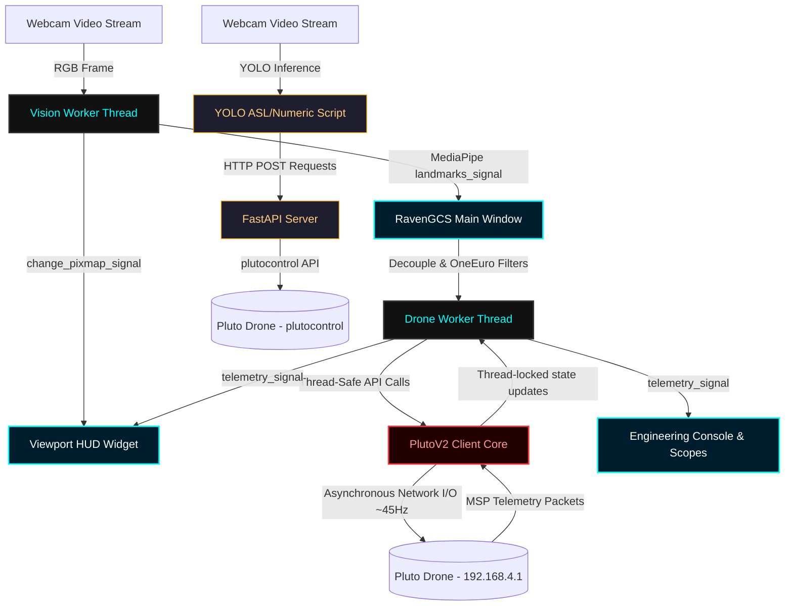

# Pluto Drone Ground Control Station: Architectural Walkthrough

Welcome! This document provides a detailed architectural breakdown of the Pluto Drone Ground Control Station (GCS) codebase. The project contains two distinct GCS implementations:
1. **Legacy Web-Based GCS**: A FastAPI web server with a real-time web dashboard using Chart.js.
2. **Next-Gen Desktop GCS (Raven GCS)**: A PyQt6-based dashboard leveraging MediaPipe hand landmarker tracking for gestural control, smooth filtering algorithms, and interactive sensor plots.

---

## 🏗️ System Architecture & Data Flow

The codebase is organized into modular layers, separating computer vision input, low-level serial communication, and the user interface.

---

## 📂 Core Component Directory

The codebase is split into the root-level web application and the newer, more advanced desktop package under the `new/` directory:

### 1. Legacy Web GCS (Root Directory)
*   **[gcs.py](file:///c:/Users/prath/Downloads/pluto/pluto-demo/gcs.py)**: FastAPI backend that handles drone flight control and exposes telemetry over a WebSocket. It imports the legacy `plutocontrol` module to send commands.
*   **[templates/index.html](file:///c:/Users/prath/Downloads/pluto/pluto-demo/templates/index.html)**: Main web page. Displays real-time attitude graphs (Roll, Pitch, Yaw, Altitude, Battery) using Chart.js.
*   **[static/script.js](file:///c:/Users/prath/Downloads/pluto/pluto-demo/static/script.js)**: Frontend logic. Connects to the `/ws/telemetry` WebSocket, updates the DOM with live metrics, pushes values to the Chart.js instances, and triggers HTTP POST requests for buttons.
*   **[static/styles.css](file:///c:/Users/prath/Downloads/pluto/pluto-demo/static/styles.css)**: Cyberpunk dark-themed CSS styling with responsive grids and glows.
*   **[gestures/gesture_asl.py](file:///c:/Users/prath/Downloads/pluto/pluto-demo/gestures/gesture_asl.py)**: Uses an ASL YOLO model (`models/best_5.pt` or `asl.pt`) to run webcam inference. Maps classes like V (Arm), W (Disarm), U (Take Off), ThumbDown (Land) to corresponding HTTP POST calls targeting the GCS server.
*   **[gestures/gesture_numeric.py](file:///c:/Users/prath/Downloads/pluto/pluto-demo/gestures/gesture_numeric.py)**: Similar to ASL script, but maps numeric fingers (1: Arm, 2: Take Off, 3: Land, 4: Disarm) using the YOLO `models/numeric.pt` model.

### 2. Next-Gen Desktop GCS (Under `new/` Directory)
*   **[new/plutov2.py](file:///c:/Users/prath/Downloads/pluto/pluto-demo/new/plutov2.py)**: A clean-room, robust, thread-safe Python driver for Pluto drones over raw TCP (`192.168.4.1:23`). 
    *   **I/O Loop**: Runs a background socket thread (`_io_loop`) at ~45Hz (22ms intervals) mapping targets to MultiWii Serial Protocol (MSP) V1 frame buffers.
    *   **Parsing**: Features a sliding-window parser to synchronize raw bytes, verify XOR checksums, handle standard `$M>` and custom `$M!` headers, and update a thread-locked shadow state.
    *   **Safety Watchdog**: Overwrites RC controls to neutral hover values (`1500` for attitude, `1500` for throttle) if no new packets are received for 500ms.
*   **[new/gesture_controller.py](file:///c:/Users/prath/Downloads/pluto/pluto-demo/new/gesture_controller.py)**: Standalone two-handed console-based flight program. Uses OpenCV and MediaPipe vision tasks (`hand_landmarker.task`) to demonstrate precision manual control over the `PlutoV2` interface.
*   **[new/gcs/main_gcs.py](file:///c:/Users/prath/Downloads/pluto/pluto-demo/new/gcs/main_gcs.py)**: PyQt6 main entry point. Orchestrates GUI layouts, binds key presses (WASD for manual flight, Space for emergency stop), and runs background worker threads.
*   **[new/gcs/workers/vision_worker.py](file:///c:/Users/prath/Downloads/pluto/pluto-demo/new/gcs/workers/vision_worker.py)**: A `QThread` capturing webcam frames and computing MediaPipe landmarks. To prevent cross-thread memory corruption, it serializes results into custom `Point` and `Category` structures before emitting signals.
*   **[new/gcs/workers/drone_worker.py](file:///c:/Users/prath/Downloads/pluto/pluto-demo/new/gcs/workers/drone_worker.py)**: A `QThread` serving as the link between the main window and `PlutoV2`. Periodically retrieves the thread-safe drone shadow state at 20Hz and forwards signals to update charts/gauges.
*   **[new/gcs/utils/gestures.py](file:///c:/Users/prath/Downloads/pluto/pluto-demo/new/gcs/utils/gestures.py)**: Houses the geometry calculators:
    *   `HandChassis`: Normalizes landmark locations relative to neutral offsets.
    *   `HandChassisStandard`: Implements Two-Hand Decoupled control (Right hand coordinates for Pitch/Roll, Left hand coordinates for Throttle/Yaw, Left index-thumb pinch for clutch activation).
*   **[new/gcs/utils/filters.py](file:///c:/Users/prath/Downloads/pluto/pluto-demo/new/gcs/utils/filters.py)**: Implements smoothing algorithms.
    *   `LowPassFilter`: Exponential moving average (EMA) filter.
    *   `OneEuroFilter`: Adaptive low-pass filter which adjusts its cutoff frequency based on velocity. High-velocity hand movements lower filtering to avoid lag; low-velocity stationary hands increase filtering to eliminate jitter.
*   **[new/gcs/widgets/viewport.py](file:///c:/Users/prath/Downloads/pluto/pluto-demo/new/gcs/widgets/viewport.py)**: Draws the camera feed overlaid with custom HUD paint operations:
    *   **Aero Horizon**: Rotation and clipping path mapping real-time roll/pitch values.
    *   **Altitude Tape**: Vertical rolling ruler indicating current drone altitude.
    *   **Compass Ribbon**: Sliding horizontal scale indicating yaw heading.
    *   **Command Gauges**: Target PWM indicators mapping R, P, T, Y channels.
*   **[new/gcs/widgets/engineering.py](file:///c:/Users/prath/Downloads/pluto/pluto-demo/new/gcs/widgets/engineering.py)**: Contains the 8-channel PWM bars and real-time PyQtGraph plots tracking Accelerometer ($G$), Gyroscope ($deg/s$), and Magnetometer ($\mu T$) data.

---

## 🎮 Flight Control & Gesture Mapping

For the PyQt6 GCS application (`Raven GCS`), a two-handed decoupled flight model is used:

| Hand / Gesture | Action | Measurement | Output Channel | Range |
| :--- | :--- | :--- | :--- | :--- |
| **Left Hand** | Clutch Activation | Pinch distance between Thumb (4) and Index (8) | N/A (software state) | Disengaged / Engaged |
| **Left Hand** | Throttle Control | Vertical wrist translation (Wrist Y coordinate) | CH3 (Throttle) | 1000 - 2000 PWM |
| **Left Hand** | Yaw (Heading) | Hand tilt wave (Pinky Y - Thumb Y) | CH4 (Yaw) | 1000 - 2000 PWM |
| **Right Hand** | Pitch (Forward/Back) | Vertical wrist translation (Wrist Y coordinate) | CH2 (Pitch) | 1000 - 2000 PWM |
| **Right Hand** | Roll (Left/Right) | Hand tilt wave (Pinky Y - Thumb Y) | CH1 (Roll) | 1000 - 2000 PWM |
| **Left Hand** | Take Off | Thumbs Up gesture | MSP command | Initiates automated takeoff |
| **Left Hand** | Land | Thumbs Down gesture | MSP command | Initiates automated landing |
| **Left Hand** | Safe Stop / Kill | Fist gesture | MSP disarm | Disarms motors instantly |

---

## 🔒 Safety & Failsafe Measures

To prevent flyaways and ensure hardware safety, the `PlutoV2` architecture includes multiple protective layers:

1.  **Dead Man's Switch (Clutch)**: If the left-hand index-thumb pinch is released, the clutch is immediately flagged as inactive. The control loop ignores any further hand movements and outputs safe neutral hover values.
2.  **Safety Watchdog**: If the vision thread or the GUI app freezes and fails to issue `set_rc` packets for more than `500ms`, the background TCP connection thread triggers the watchdog, locking the drone in a neutral hover state.
3.  **Physical Kill Switch**: In an emergency, forming a closed fist on the left hand or pressing `Spacebar` on the keyboard instantly fires a disarm packet, shutting down all motors immediately.
4.  **Graceful Shutdown**: The FastAPI and PyQt6 applications capture termination signals (SIGINT/SIGTERM). When exiting, the program attempts to command landing, waits 1 second, disarms, and safely shuts down the TCP socket.
